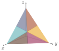
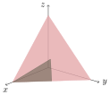
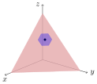
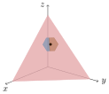
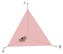

# MajorizationFigures

Generate publication-quality pictures of points and polyhedra in the probability
simplex in ℝ³ via Tikz, by using Polyhedra.jl and TikzPictures.jl. This package
is mostly aimed at generating figures for my thesis.

There are a couple interesting polytopes in the probability simplex:

* The total variation distance ball around a probability vector
* The infinity-norm ball around a probability vector
* The set of probability vectors majorized by a given probability vector

This package depends on the unregistered package `MajorizationExtrema`.

